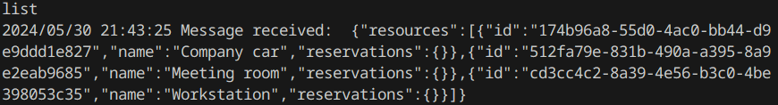
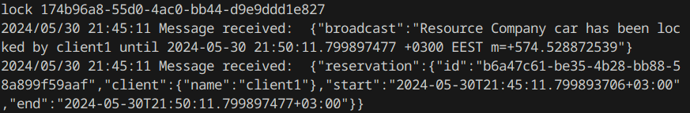
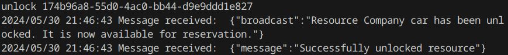
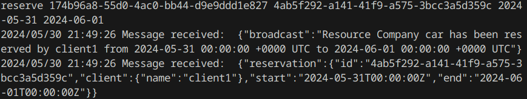
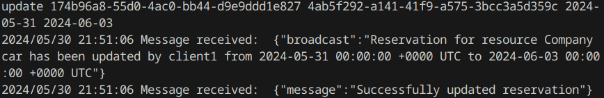
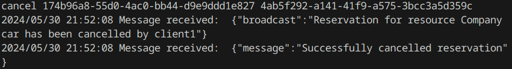

# Hardwire
> Final project for Computer Networks course.

## Requirements

- The server manages a list of resources that can be allocated to clients for a specific time interval.
- The client authenticates using a name and receives the list of resources along with the list of reservations for each resource.
- A client can request to lock a resource for a time interval in order to complete a reservation.
- The server notifies all authenticated clients about the resource lock for the reservation, so that no other client can request a reservation for the same resource during the same time interval.
- The client who initiated the reservation can cancel the request, in which case the server notifies all clients that the resource is no longer locked for that time interval.
- The client who locked the resource can finalize the reservation, in which case the server notifies all authenticated clients about the new reservation created.
- A client can update the start and end times for a reservation they made previously, in which case the server will notify all authenticated clients about the change.
- A client can delete a reservation they made previously, in which case the server will notify all authenticated clients about the deletion.

## Prerequisites
- You need to have installed at least golang v1.22.0. You can check this by running `go version`. For more information, see [how to install golang](https://go.dev/doc/install).

## How to run
- Make sure that you are in the root directory of the repository.
- Launch the **server** using `go run server/cmd/main.go`.
- Launch the **client** using `go run client/cmd/main.go`.

## Available commands

- `list` : List all resources. 

- `lock [resource_id]` : Lock a resource.

- `unlock [resource_id]` : Unlock a resource.

- `reserve [resource_id] [reservation_id] [start|YYYY-MM-DD] [end|YYYY-MM-DD]` : Reserve a resource.

- `update [resource_id] [reservation_id] [start|YYYY-MM-DD] [end|YYYY-MM-DD]` : Update a reservation.

- `cancel [resource_id] [reservation_id]` : Cancel a reservation.

